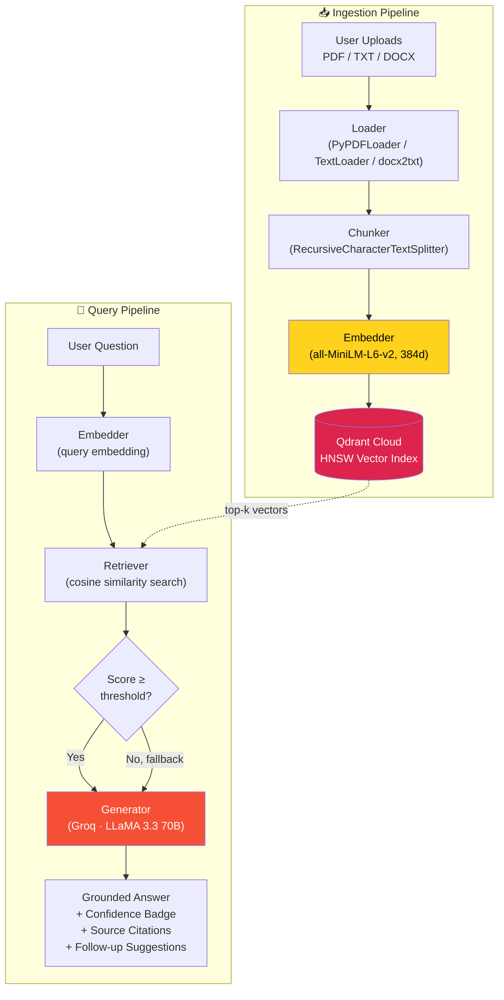

<div align="center">

# 🧠 Adaptive RAG Assistant

**A production-styled Retrieval-Augmented Generation platform with real-time vector control, confidence-scored answers, and sub-second inference.**

[](https://www.python.org/)
[](https://streamlit.io/)
[](https://qdrant.tech/)
[](https://groq.com/)
[](LICENSE)

[**🚀 Live Demo**](https://rago-agento.streamlit.app/) · [**🐛 Report a Bug**](../../issues) · [**✨ Request a Feature**](../../issues)

</div>

> **Note:** Replace the Live Demo link above once deployed, and swap the badge/repo URLs to match your GitHub username.

---

## 🎯 Overview

**Adaptive RAG Knowledge Assistant** is a full-stack Retrieval-Augmented Generation system that lets you upload your own documents (PDF, TXT, DOCX), index them into a live vector database, and ask natural-language questions grounded strictly in that content — with zero hallucination tolerance by design.

Unlike a lot of RAG demos that hardcode a static knowledge base, this system treats the vector store as a **live, mutable data source**: add documents, remove them, watch memory usage shift in real time, and tune retrieval behavior on the fly with interactive hyperparameter sliders — all without restarting the app or re-deploying.

Every answer ships with a **color-coded confidence badge** so you always know whether the model is speaking from solid grounding or thin evidence, plus the exact source chunks and cosine similarity scores behind it.

---

## ✨ Features

| | |
|---|---|
| 📁 **Multi-format ingestion** | Upload PDF, TXT, and DOCX files directly from the sidebar — parsed, chunked, and embedded in one pass |
| ☁️ **Live vector sync** | Documents are embedded and upserted into **Qdrant Cloud** in real time, with instant re-indexing |
| 🗑️ **Dynamic source control** | Remove any indexed document with one click — vectors are purged from Qdrant immediately, verified, and reflected in the UI |
| 🎛️ **Tunable retrieval hyperparameters** | Live sliders for Top-K chunk count, cosine similarity threshold, and LLM temperature — no code changes required |
| ⚡ **Groq LPU inference** | Answers generated via Groq's LPU-accelerated **LLaMA 3.3 70B Versatile** for near-instant responses |
| ✅ **Confidence-scored answers** | Every response gets a color-coded badge (High / Medium / Low / No Context) based on retrieval similarity, so you never mistake a shaky answer for a grounded one |
| 💡 **Auto-suggested follow-ups** | The assistant proactively suggests 2–3 natural follow-up questions after each answer — click one to ask it instantly |
| 🔍 **Full source transparency** | Expand any answer to see the exact chunks retrieved, their source file, page number, and cosine similarity score |
| 💾 **Vector memory telemetry** | Live-updating sidebar readout of estimated vector store memory usage, recalculated on every index/purge |
| 🌗 **Dark / light mode** | Full theme toggle with a hand-built design system — not just an inverted filter |
| 🛡️ **Grounded-only responses** | The LLM is explicitly instructed to refuse rather than hallucinate when context is insufficient |

---

## 🏗️ Architecture



**Design principle:** retrieval never hard-fails. If nothing clears the similarity threshold, the system falls back to the best available chunks and flags them `low_confidence` — so the assistant degrades gracefully instead of falsely claiming ignorance.

---

## 🧰 Tech Stack

| Layer | Technology |
|---|---|
| **Frontend / UI** | [Streamlit](https://streamlit.io/) with a custom light/dark design system |
| **LLM Inference** | [Groq](https://groq.com/) — LLaMA 3.3 70B Versatile (LPU-accelerated) |
| **Vector Database** | [Qdrant Cloud](https://qdrant.tech/) — HNSW cosine similarity index |
| **Embeddings** | [HuggingFace `all-MiniLM-L6-v2`](https://huggingface.co/sentence-transformers/all-MiniLM-L6-v2) (384-dim) via `langchain-huggingface` |
| **Document Parsing** | `PyPDFLoader`, `TextLoader` (LangChain), `docx2txt` |
| **Chunking** | LangChain `RecursiveCharacterTextSplitter` |
| **Config Management** | `python-dotenv` |

---

## 📂 Project Structure

```
rag-knowledge-assistant/
│
├── app.py                      # Streamlit entrypoint — UI, session state, orchestration
├── config.py                   # Environment variables & tunable defaults
├── requirements.txt
├── .env                        # API keys & cluster URLs (not committed)
├── .streamlit/
│   └── config.toml             # Forces consistent light theme baseline
│
├── core/
│   ├── embedder.py             # HuggingFace embedding wrapper (query + document)
│   ├── vector_store.py         # Qdrant client — upsert, search, delete, memory stats
│   ├── retriever.py            # Query embedding → search → threshold filtering
│   ├── generator.py            # Groq-backed answer + follow-up generation
│   └── evaluator.py            # Retrieval/grounding telemetry (GCI scoring)
│
├── ingestion/
│   ├── loader.py                # Multi-format document parsing (PDF/TXT/DOCX)
│   └── chunker.py               # Recursive character-based text splitting
│
├── data_manager/
│   └── source_manager.py        # Orchestrates ingest/delete pipeline end-to-end
│
└── ui/
    └── styles.py                 # Light/dark design tokens & injected CSS
```

---

## 🚀 Getting Started

### Prerequisites

- Python **3.10+**
- A free [Qdrant Cloud](https://cloud.qdrant.io/) cluster (or a self-hosted instance)
- A free [Groq API key](https://console.groq.com/keys)

### 1. Clone the repository

```bash
git clone https://github.com/your-username/rag-knowledge-assistant.git
cd rag-knowledge-assistant
```

### 2. Set up a virtual environment

```bash
python -m venv venv
source venv/bin/activate      # Windows: venv\Scripts\activate
```

### 3. Install dependencies

```bash
pip install -r requirements.txt
```

### 4. Configure environment variables

Create a `.env` file in the project root:

```env
QDRANT_URL=https://your-cluster-id.region.cloud.qdrant.io:6333
QDRANT_API_KEY=your-qdrant-api-key
GROQ_API_KEY=your-groq-api-key
```

### 5. Run the app

```bash
streamlit run app.py
```

The app will be live at `http://localhost:8501`.

---

## 🎛️ Configuration

All defaults live in `config.py` and can be overridden live via the sidebar sliders:

| Parameter | Default | Description |
|---|---|---|
| `DEFAULT_TOP_K` | `3` | Number of chunks retrieved per query |
| `DEFAULT_SIMILARITY_THRESHOLD` | `0.30` | Minimum cosine similarity for a "high confidence" match |
| `DEFAULT_TEMPERATURE` | `0.1` | LLM sampling temperature (low = more deterministic) |
| `CHUNK_SIZE` | `500` | Target characters per chunk |
| `CHUNK_OVERLAP` | `50` | Overlap between adjacent chunks to preserve context |

> **Why 0.30 and not higher?** Small embedding models like `all-MiniLM-L6-v2` don't produce a consistent absolute similarity scale — genuinely relevant matches can score anywhere from 0.15–0.6 depending on phrasing and document register. A conservative default paired with a low-confidence fallback (rather than a hard cutoff) avoids false "not found" responses.

---

## 🔬 How It Works

**Ingestion:**
1. A document is uploaded and parsed by format-specific loaders into raw text + page metadata.
2. Text is split into overlapping chunks (500 chars, 50 char overlap) via a recursive character splitter that respects paragraph/sentence boundaries where possible.
3. Each chunk is embedded into a 384-dimensional vector using `all-MiniLM-L6-v2`.
4. Vectors + payload (source file, page, chunk index) are upserted into a Qdrant HNSW collection.

**Querying:**
1. The user's question is embedded using the same model.
2. Qdrant performs an approximate nearest-neighbor search (HNSW) to retrieve the top-k most similar chunks.
3. Chunks scoring above the similarity threshold are passed to the LLM as grounding context; if none clear the bar, the best available chunks are used and flagged low-confidence.
4. Groq's LLaMA 3.3 70B generates a response constrained to only use the provided context — with explicit instructions to state when information isn't present rather than fabricate it.
5. A confidence badge, source citations, and follow-up question suggestions are rendered alongside the answer.

---

## 🗺️ Roadmap

- [ ] Export chat history as Markdown/PDF
- [ ] Highlight the exact matched sentence within source previews
- [ ] Multi-language query support
- [ ] Persistent chat history across sessions
- [ ] Streaming token-by-token responses

Contributions and suggestions welcome — see below.

---

## 🤝 Contributing

Contributions are welcome! To get started:

1. Fork the repository
2. Create a feature branch (`git checkout -b feature/amazing-feature`)
3. Commit your changes (`git commit -m 'Add amazing feature'`)
4. Push to the branch (`git push origin feature/amazing-feature`)
5. Open a Pull Request

---

## 📄 License

Distributed under the MIT License. See `LICENSE` for more information.

---

## 🙏 Acknowledgments

- [Groq](https://groq.com/) for LPU-accelerated inference
- [Qdrant](https://qdrant.tech/) for the vector database
- [HuggingFace](https://huggingface.co/) for the embedding model
- [Streamlit](https://streamlit.io/) for the app framework
- [LangChain](https://www.langchain.com/) for document loading & text splitting utilities

<div align="center">

**Built with ☕ and a healthy distrust of hallucinated answers.**

</div>
